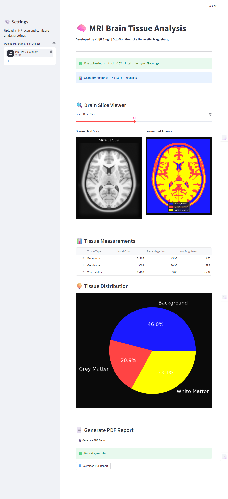

# MRI Brain Tissue Analysis Web App

An interactive web application for automated MRI brain tissue segmentation, analysis and clinical report generation.

## Live Demo

Upload any NIfTI MRI scan and instantly get:
- Real-time brain slice navigation
- Automated tissue segmentation
- Clinical measurements
- Downloadable PDF report

## Screenshots



## Features

- 📁 **Upload any MRI scan** — supports .nii and .nii.gz formats
- 🔍 **Interactive slice viewer** — navigate through all brain slices with a slider
- 🤖 **Automatic segmentation** — K-means clustering classifies tissue instantly
- 📊 **Clinical measurements** — voxel counts, percentages, signal intensities
- 🥧 **Tissue distribution chart** — pie chart showing brain composition
- 📄 **PDF report generation** — professional clinical report with one click

## Tissue Classification

- 🔵 **Background** — area outside the brain
- 🔴 **Grey Matter** — outer brain tissue (thinking regions)
- 🟡 **White Matter** — inner brain connections

## Technologies Used

- **Python 3.13**
- **Streamlit** — web application framework
- **NiBabel** — MRI file handling
- **Scikit-learn** — K-means clustering for segmentation
- **NumPy & Pandas** — numerical analysis
- **Matplotlib** — visualisation and charts
- **ReportLab** — automated PDF report generation
- **Nilearn** — neuroimaging datasets

## Installation

```bash
git clone https://github.com/kuljit-medtech/MRI-webapp.git
cd MRI-webapp
python -m venv venv
.\venv\Scripts\Activate.ps1
pip install streamlit nibabel nilearn matplotlib numpy scipy scikit-learn reportlab pandas
```

## Usage

```bash
streamlit run app.py
```

Then open your browser at **http://localhost:8501**

Upload any NIfTI MRI file (.nii or .nii.gz) and the app will automatically:
1. Load and display the scan
2. Segment brain tissue
3. Show measurements
4. Generate a PDF report

## Supported MRI Formats

- NIfTI (.nii)
- Compressed NIfTI (.nii.gz)

## Free MRI Data Sources

- [OpenNeuro](https://openneuro.org) — real anonymised research scans
- [IXI Dataset](https://brain-development.org/ixi-dataset) — 600 real brain MRI scans
- [BrainWeb](https://brainweb.bic.mni.mcgill.ca) — simulated brain MRI

## About

Developed by **Kuljit Singh** — MS student at Otto Von Guericke University, Magdeburg, Germany.

Part of a medical imaging portfolio focusing on MRI processing, quality assurance and AI-based analysis.

- 🔗 [GitHub](https://github.com/kuljit-medtech)
- 🔗 [LinkedIn](https://www.linkedin.com/in/kuljit-singh-021252197/)
- 🔗 [MRI Brain Viewer](https://github.com/kuljit-medtech/mri-brain-viewer)
- 🔗
